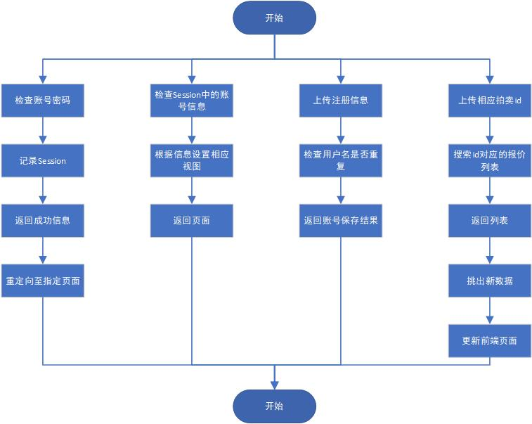
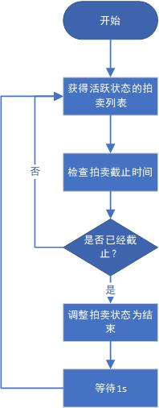
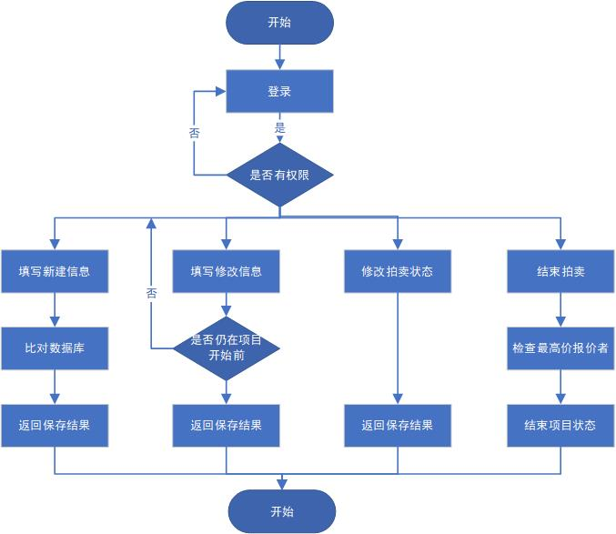
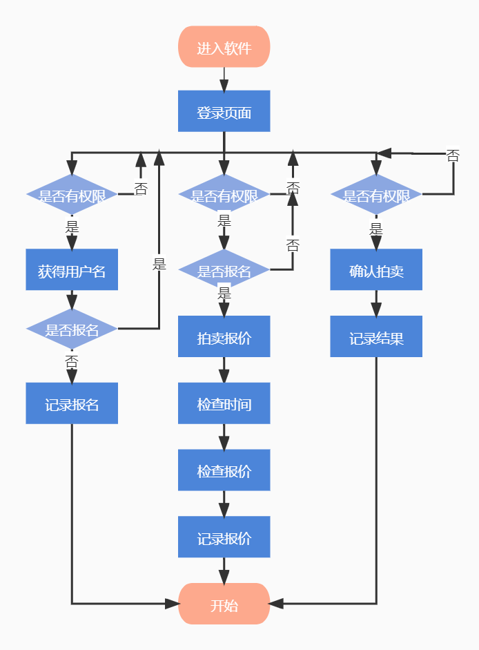
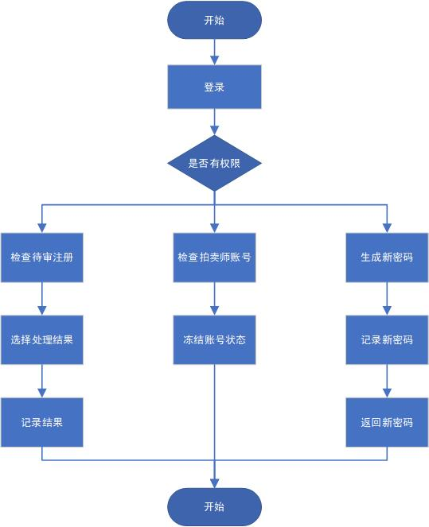
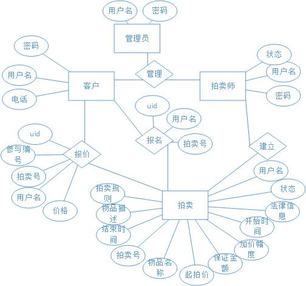
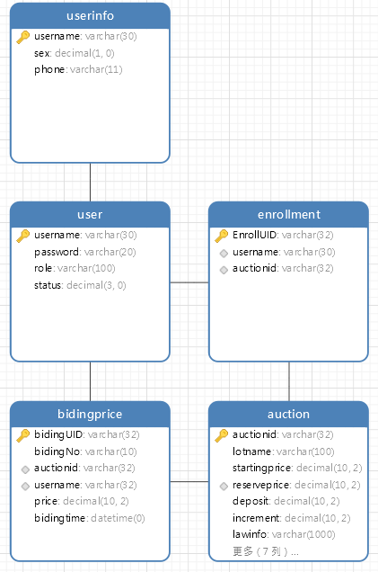

# Detailed Design

## 1.公共服务功能

本项目的公共服务功能是面向所有使用者的服务，它的模块流程图如上所示。
其主要包括了登录任务、注册任务、搜索拍卖的相应报价列表和根据状态返回相应的拍卖详情页面。

### 1.1 普通公共服务

登录功能如图所示，首先输入账号密码，接着选择登录角色，最后选择登录按钮。
接着前端视图会发送异步请求，至后端的相应服务中处理。通过验证账号密码后，检查账号状态，
若状态为激活，在服务器的session中保存相应的用户名、角色信息。然后返回前端统一包装体的成功信息，
接到成功信息后，前端根据登录的角色类型将页面重定向至对应的页面中去，完成登录流程。

注册任务的流程是发送注册信息，根据选择的注册账号角色选择对应的账号状态，
普通用户直接处于激活状态，而拍卖师用户则处于待审核状态。然后检查用户名是否重复，
若不重复，则记录账号信息，返回保存结果。

搜索拍卖的相应报价列表功能首先根据拍卖的uid搜索相应的报价列表，
通过统一包装的方式，把列表信息包装返回。在对应视图中，把列表信息中的数据与旧信息对照，
挑出新数据，并顺序将数据更新在前端的列表视图中。

### 1.2 自动结束拍卖服务

当拍卖的时间已经截止，而拍卖师不能及时、准时的操作时，需要系统后台自动结束拍卖，
为了更好说明该服务，它的详细流程图如上所示。首先，服务启动后将会搜索所有处于正在进行状态的拍卖，
然后检查每个拍卖的截止时间是否已经到达，若到达，则查找报价列表的最大值，
并把买受人信息标注为该报价条目的报价者。若没有人报价，则标注“pass”，示意流拍。
检查完拍卖列表后，服务结束，定时1秒后重新执行流程。

## 2. 发起拍卖功能

本项目的发起拍卖功能模块的流程图如上所示，该模块的使用者是拍卖师。
它的主要功能包括新建拍卖、修改拍卖、修改拍卖状态为暂停、继续和提前结束拍卖。

新建拍卖功能首先要求拍卖师填写相应信息上传后端，然后后台检查账号的权限和用户名，
生成新的拍卖编号，并将这些信息一同记录进数据库，并返回前端保存结果，完成新建。

修改拍卖信息功能同新建类似，首先填写修改的信息后将数据整体提交至后端，
后端除了检查权限、用户名，还对开始时间进行验证。若项目已经开始，则不能修改。
在修改完成后，统一包装保存结果，返回前端。

修改拍卖状态是修改拍卖的暂停、继续的状态。即提交修改的状态信息和对应的拍卖uid，
然后验证拍卖信息是否对应，最后保存数据库，返回保存结果。

结束拍卖功能和上述修改状态的功能类似，在后端获得修改的状态信息和对应的拍卖uid后，
会检索该项目的报价列表，寻找最大值的报价人，并把拍卖状态更改为结束但未确认。
做完上述操作之后，统一包装结果返回前端。

## 3. 参与拍卖功能

本项目的参与拍卖功能流程图如上所示。该模块的使用者是普通用户，也是实际参与拍卖的人。
它的主要功能有报名拍卖、拍卖报价、确认拍卖结果。

报名拍卖流程是提交报名请求，后端检验该用户是否已经报名，若未报名则记录报名信息，
并把保存结果返回。若已报名，则返回报错信息，防止恶意请求API导致重复报名。

拍卖报价功能首先提交报价请求，包括价格、报价者用户名和拍卖uid，然后后端对数据进行检查。
需要检查拍卖是否结束，报价是否高于起拍价，是否高于拍卖列表中的最高价，
是否符合提价幅度的规则等，若都验证通过，则将该请求记录进数据库，并返回记录结果至前端。

确认拍卖结果功能主要解决拍卖结束后，买受人对拍卖的确认需求。
买受人可以选择确认拍卖信息，也可以选择拒绝确认拍卖品。该功能通过返回用户不同的决定状态实现，
后端将验证用户是否为买受人，若确定用户与买受人一致，则将决定的状态写入数据库，
最后把结果返回至前端。

## 4. 账号管理功能

上图显示了项目的账号管理功能，该功能由管理员使用。主要包括审批拍卖师注册，冻结账号，
以及生成新密码。

审批拍卖师注册是修改新注册的拍卖师的账号状态。通过看拍卖师的账号信息，管理员可以选择批准或者拒绝注册，
并将结果保存数据库，返回保存结果。通过更改账户的状态，将拍卖师的账户激活。

冻结账户同理，流程是获得被操作的用户名，并更改账户的状态为删除，最后返回结果至前端。

生成新密码在获得用户名后，随机生成6位的密码，更改数据库中对应账号的密码，并把密码返回前端，
供管理员查看。

## 5. 数据库设计

本数据库的ER图如图所示。将三种不同类型的用户合并在一张表中记录，共有xx张表。
用户表记录着用户在本系统中的状态以及用户的账号信息。
用户信息表记录用户的手机号、性别等个人信息。
拍卖表记录拍卖的详细信息，包括其描述、状态、建立者等关键信息。
报价表记录整个系统的报价数据，通过用户名和拍卖uid和相关数据联系起来，记录报价的价格。
报名表记录普通用户报名项目的记录。
这些表的设计信息如下图所示。

