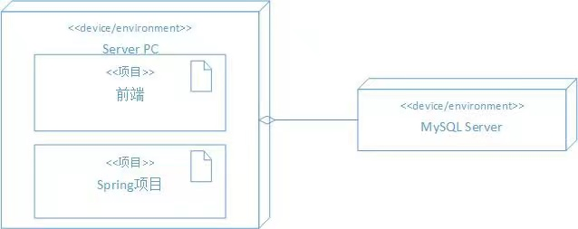

# Train A4: Auction System

## 1. 项目需求
### a. 项目背景
&ensp;&ensp;&ensp;&ensp;某拍卖公司主要经营艺术品的拍卖工作。在进行一次线下拍卖时，
拍卖师将一件贵重艺术品放到台上，打开了一个竞拍系统，并开始介绍这件拍品。随后，不断有客人进行加价，
拍卖师不知道这些人是谁，但是能够清楚的在系统上看清他们的最新报价和报价时间。
最终，竞拍品被出价最高的人拍下，拍卖师关闭系统。
### b. 项目介绍
* 项目甲方：组内模拟
* 交付信息：交付项目原型，以供和甲方进一步分析讨论，迭代项目
* 交付日期：2021.11.07
* 保密性：对系统进行加密打包部署（甲方不允许获得源代码）
* 法律问题：包括金钱交易等敏感操作，涉及拍卖法等，需要买卖、中介三方进行反复确认
### c. 项目验收指标
* 通过验收考核，做一个时间范围内尽可能详细的拍卖原型系统，且文档丰富合理
### d. 项目功能需求
* 见[Requirements.md](./Requirements.md)

## 2. 项目部署
### a. 硬件环境
* PC机，原型不需要服务器
### b. 软件环境
* Java 8
* MySQL 5.7
### c. 部署视图

## 3. 项目架构
### a. 技术架构

### b. 模块设计

## 4. 项目制成品

| 制品 | 类型 | 配套文档 | 内容说明 | 归档时间 |
|:---: |:---:|:-------:|:--------|:-----:|
| 主文档 | 文档 | [主文档](./Main.md) | 文档检索 | 2021.11.01 |
| 需求文档 | 文档 | [需求文档](./Requirements.md) |  分析需求 | 2021.11.02 |
| 总体设计文档 | 文档 | [总体设计文档](./TotalDesign.md) | 总体设计4+1 | 2021.11.02 |
| 详细设计文档 | 文档 | [详细设计文档](./DetailedDesign.md) | 详细设计流程 | 2021.11.06 |
| 主系统 | jar包 | [打包系统](./encrypted.jar) | 加密打包的项目 | 2021.11.07 |