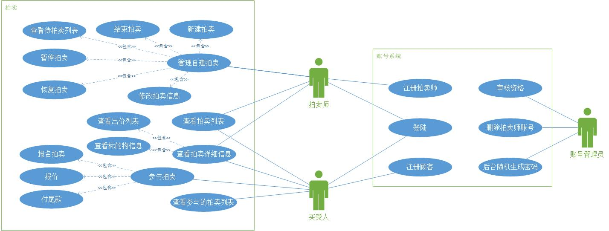

# Requirements

## 1. 功能性需求分析
&ensp;&ensp;&ensp;&ensp;根据主文档中的项目背景说明，本系统的用户角色主要为
拍卖师和客户，在此基础上客户可分为买受人和委托人，此外系统本身还需要账户维护的超级管理员。
每个用户角色需要有不同的功能，其中拍卖师需要能够主持拍卖，进行相关拍卖内容的管理，买受人需要能够
参加实际的拍卖活动，委托人则需要能够提交拍卖物品和申请，最后管理员能够管理拍卖师的账号信息。
经过竞品分析，很少有做荷兰式拍卖的系统，因此不考虑。基于如上的大致分析，可得到用例图如下。

## 2. 项目功能需求
&ensp;&ensp;&ensp;&ensp;根据第一节中的用例图分析，我们可以将项目需求细分如下。
* 超级管理员（Root）
  * 账号管理
      * 审核批准拍卖师注册
      * 删除拍卖师账号
      * 重置密码，随机生成新密码
* 拍卖师（Auctioneer）
  * 登录、注册，其注册需要超级管理员批准
  * 管理相关拍卖
    * 新建一个拍卖大厅，每个拍卖大厅中包括一个拍卖品，设置拍卖的相关信息，包括：拍卖标的、
      委托拍卖合同、拍卖规则、估价、延时出价功能、起始价格、保证金、加价幅度、开始/结束时间等等
    * 在开始时间之前，修改拍卖大厅的相关信息
    * 暂停拍卖，冻结拍卖大厅
    * 恢复拍卖，拍卖重新开始计时，自动将结束时间延后暂停时长
    * 提前结束拍卖，直接以当前最高价格成交
    * 查看自己创建的拍卖大厅列表
* 买受人（客户）
  * 参与拍卖 
    * 报名拍卖，付保证金
    * 出价
    * 选择是否要反悔，或者付尾款（如果价格比保证金高，要求减去保证金的价格）
    * 查看自己的参加列表
* 公开信息
    * 登录
    * 普通账号注册，无需注册审核
    * 查看拍卖标的物列表
    * 进入标的物的相应拍卖大厅，查看拍卖相关信息
    * 查看出价列表和出价时间，但看不见出价人，只能看见编号

## 3. 功能详细分析
### 3.1 登录、注册功能的需求分析
&ensp;&ensp;&ensp;&ensp;本功能面向的功能是所有用户角色，包括拍卖师、客户、管理员。
所有用户均需要先登录其相应账号，才能使用其相关的功能服务。

|  ID    | UC1                          |
|:-----: |:-----------------------------|
| 用例名称 | 登录功能                      |
| 用例描述 | 系统用户的登录功能，所有相应服务均需登录后才能使用 |
| 参与者   | 拍卖师、客户、管理员            |
| 前置条件 | 用户联网                      |
| 后置条件 | 用户查看到了展示在界面中的服务列表 |
| 正常流程 | 1.打开系统的登录网页  2.输入用户名密码，选择相应的用户角色 3.点击登录按钮发送登录请求 |
| 扩展流程 | 3a.若用户名密码错误，则拒绝其登录 |

|  ID    | UC1                          |
|:-----: |:-----------------------------|
| 用例名称 | 注册功能                      |
| 用例描述 | 系统用户的注册功能，用于注册新账号 |
| 参与者   | 拍卖师、客户                   |
| 前置条件 | 用户联网                      |
| 后置条件 | 用户查看到了登录界面            |
| 正常流程 | 1.进入注册页面  2.注册用户名密码，选择相应的用户角色 3.点击注册按钮发送注册请求 |
| 扩展流程 | 3a.若用户名重复，则拒绝其注册    |

### 3.2 账号管理功能的需求分析
&ensp;&ensp;&ensp;&ensp;本系统的超级管理员角色定位是管理账户系统，无法对拍卖内容进行管理。
其账户管理系统包括如下审核批准拍卖师注册、删除拍卖师账号、重置密码，随机生成新密码。

|  ID    | UC2                          |
|:-----: |:-----------------------------|
| 用例名称 | 拍卖师注册审核功能              |
| 用例描述 | 管理员审核拍卖师资质            |
| 参与者   | 管理员                       |
| 前置条件 | 管理员已经登录                 |
| 后置条件 | 管理员查看到了审核结果           |
| 正常流程 | 1.进入管理界面，选择注册审核  2.选择相应的注册请求是否通过  |
| 扩展流程 | 2a.选择相应的注册请求是否拒绝    |

|  ID    | UC2                          |
|:-----: |:-----------------------------|
| 用例名称 | 注销拍卖师账号功能              |
| 用例描述 | 管理员注销拍卖师账号            |
| 参与者   | 管理员                       |
| 前置条件 | 管理员已经登录                 |
| 后置条件 | 管理员查看到了操作结果           |
| 正常流程 | 1.进入管理界面，选择拍卖师列表  2.选择相应的账号中的注销按钮  |
| 扩展流程 | 无                           |

|  ID    | UC2                          |
|:-----: |:-----------------------------|
| 用例名称 | 随机生成密码功能              |
| 用例描述 | 管理员随机生成相应账号密码       |
| 参与者   | 管理员                       |
| 前置条件 | 管理员已经登录                 |
| 后置条件 | 管理员查看到了操作结果           |
| 正常流程 | 1.进入管理界面，选择账号列表  2.选择相应的账号中的重置按钮  3.获得随机密码弹窗 |
| 扩展流程 | 无                           |

### 3.3 相关拍卖管理功能需求分析
&ensp;&ensp;&ensp;&ensp;拍卖师进入系统页面后，可以进行与自己相关的拍卖的管理，
与其无关的拍卖项目不会出现在他的管理列表中，保证用户不会影响与其无关的服务。首先拍卖师可以新建一个
拍卖，从待拍卖的申请列表中选择一条进行新建。拍卖师还能暂停或者恢复正在进行中的拍卖，
恢复后拍卖的截止时间自动延长暂停时长。拍卖师能够提前结束自己创建的拍卖，无视设置的结束时间，
成交者是结束时的报价最高者。若拍卖没有正式开始，则拍卖师可以修改拍卖信息。

|  ID    | UC3                          |
|:-----: |:-----------------------------|
| 用例名称 | 新建拍卖功能              |
| 用例描述 | 拍卖师新建拍卖            |
| 参与者   | 拍卖师                       |
| 前置条件 | 拍卖师已经登录                 |
| 后置条件 | 拍卖师能在拍卖列表中看到新的拍卖  |
| 正常流程 | 1.进入管理界面，选择新建拍卖  2.选择待拍卖申请  3.填入相关信息  4.选择发布 |
| 扩展流程 | 4a.若其他拍卖师刚好提前一步发布，要提示无法发布 |

|  ID    | UC3                          |
|:-----: |:-----------------------------|
| 用例名称 | 修改拍卖功能              |
| 用例描述 | 拍卖师修改拍卖            |
| 参与者   | 拍卖师                       |
| 前置条件 | 拍卖师已经登录                 |
| 后置条件 | 拍卖师能在拍卖信息中看到新的信息  |
| 正常流程 | 1.进入管理界面，选择已经建立的拍卖  2.选择修改拍卖信息  3.填入相关信息  4.选择发布 |
| 扩展流程 | 2a.若拍卖已经处于开始状态，则返回“无法修改”的信息 |

### 3.4 参与拍卖功能需求分析
&ensp;&ensp;&ensp;&ensp;客户登录系统后，可以选择参加拍卖功能，成为受买者。受买者可以报名拍卖，
在已经开始的拍卖中，通过交保证金实现报名。受买者可以在拍卖中按照拍卖规则进行报价，其个人名称等信息不会暴露，
会以报价码+价格的形式显示在报价列表记录中。在拍卖结束后，成功中标者可以选择付尾款，也可以选择拒绝支付，
损失保证金。

|  ID    | UC4                          |
|:-----: |:-----------------------------|
| 用例名称 | 报名拍卖功能              |
| 用例描述 | 受买者报名参加拍卖            |
| 参与者   | 客户                       |
| 前置条件 | 客户已经登录                 |
| 后置条件 | 拍卖师能在拍卖信息中看到新的信息  |
| 正常流程 | 1.进入拍卖列表，选择正在进行的拍卖  2.查看拍卖信息  3.点击报名交钱按钮 |
| 扩展流程 | 无                         |

## 3. 项目非功能需求

本系统是拍卖行使用的电子拍卖系统，旨在方便用户和拍卖师在线上完成拍卖，
因此需要系统具有较强的可靠性、安全性、稳定性，需要注意拍卖流程中的并发问题，
避免因同时、集中的操作导致系统数据出错，同时需要注意拍卖涉及的资金数额较大，
手续、法律问题复杂，需要保证数据的加密、可靠。由于系统是拍卖师发起拍卖，
普通用户参与拍卖，因此必须注意使用流程的易用性，系统需要容易学习使用，
并且相较于传统线下举手等报价方式，使用效率应该要有较高的提升，
这要求界面必须友好简单、美观大方，保证用户界面一致性。
系统应该设计合理，具有较高的可伸缩性、可扩展性、可移植性。
此外还有联机帮助和环境相关帮助、向导和代理、用户手册和培训材料等维护服务需求。

## 4. 项目未来的变更改进

本系统仍为原型系统，仅仅包括拍卖系统的启动拍卖和参与拍卖的核心业务，
因此仍然需要未来的变更改进，包括支付、个人信息管理收集、申请发起拍卖、
数据库并发处理、实际生产环境服务器部署等。支付指使用第三方的支付平台，
利用他们提供的接口实现线上的保证金、尾款的支付和订单管理。
个人信息管理收集包括了对客户信息的收集，目前仅仅设置了几个信息作为示例，
实际需求仍需讨论解决。申请发起拍卖指客户可以把自己想要发起拍卖的物品上传线上，
以供拍卖行、拍卖师等检验，并在未来发起拍卖。数据库并发处理代表对数据库业务的进一步优化，
防止因为同时报价等因素，导致系统数据出现冲突。实际生产环境的部署包括了服务的打包、
第三方供应商选择等内容，也包括数据库的备份存储方案等，均等待后续开发的设计于确认。

