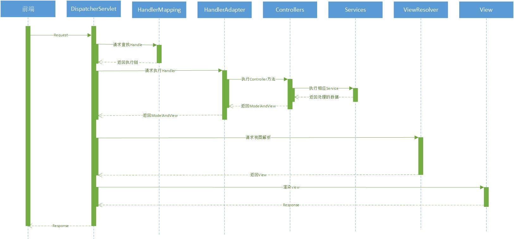

# Total Design

## 1. 整体架构

本项目的总体架构如上图所示。系统最上层为前端UI，包括了HTML、CSS、Jquery等，
这些通过浏览器引擎使用，并通过Http和后端交互。展示层采用Thymeleaf模块渲染网页，
传至前端显示视图，同时部分纯数据的请求使用Ajax交互完成异步通讯。本系统考虑开发时间、
开发人手等，不采用前后端分离模式。所有通过ajax异步请求的内容均使用统一返回体包装，
方便前端解析。服务层根据系统的使用角色分为了5个模块，其中Spring模块指系统后端使用Spring框架，
该框架包装了后端对Http请求的一切处理方式。拍卖师服务包装了所有和拍卖师相关的服务，
其他服务同理。公共服务包括了公共的数据接口，即拍卖列表、拍卖详情、报价详情、登录注册等。
数据层指利用Mybatis实现的一切持久层服务。数据库层是MySQL数据库。整个系统运行在独立主机或第三方
虚拟主机上。

## 2. 逻辑视图

本项目的逻辑视图如上所示。本项目的入口是三个用户前端视图，包括普通用户的视图、
拍卖师的视图和管理员的视图，都是网页前端界面。各个前端视图控制后端的服务，
用户视图使用登录、参加拍卖，拍卖申请的服务，拍卖师视图使用登录、管理拍卖的服务，
管理员使用登录、管理账号的服务。所有的服务均使用数据持久服务，也就是说，
所有服务产生的数据均会保存在MySQL数据库中。

## 3. 开发视图

本项目的开发视图如上所示。网络处理包包含的API等是项目的入口，包括了Spring服务中
Http处理相关机制、异常处理，以及对数据有效性进行校验，还有统一的数据返回包装，
保证了数据返回格式的统一，方便调用。经过Spring处理过的请求会映射到相应的Controller中，
控制器包实现了对所有的服务的调用和控制，不同的用户请求对应着不同角色功能的控制器。
系统的几大功能分别对应着相应的功能包。公共服务包处理对所有用户开放的服务，
包括查看正在进行的拍卖列表和相关详细信息。拍卖师服务包包括了所有拍卖管理的服务，
包括查看待拍卖物品列表、新建/拒绝拍卖、暂停/恢复拍卖、修改拍卖信息和结束拍卖等。
买受人服务包包括了普通用户的参与拍卖功能，处理用户的报名、报价、付尾款和历史参与列表。
管理员服务包处理了账号管理功能，是管理员功能的集合，处理了密码重置、账户删除、
审核拍卖师的功能。所有的服务包包括数据存储处理的需求，因此有存储服务包，
处理与数据库相关的功能，包括了操作MySQL的所有文件和方法。
所有的服务包都需要操作对象，在服务中内存中进行数据计算，因此有对象实体包，
包括了普通的数据对象、前后端交互用的展示对象和数据处理的业务对象。

## 4. 进程视图

本项目的进程视图如上所示。本系统的各个功能间不存在耦合冲突、互相调用，
功能间不存在必须先后使用的关系。所有的服务包本质都是包装了数据库的增删改查操作，
因此项目的进程关系仅存在于Spring的请求处理中。本系统的参与拍卖功能的分析如上图。
用户首先操作前端，发送登录请求到Spring后端。后端将请求分发到登录功能中，返回个人主页视图。
然后用户发送请求，查看正在进行的拍卖列表，参与拍卖功能返回相应列表视图。用户在该视图中查看详细信息，
发送请求至公开信息功能中，获得详细信息视图，并同时自动请求参与拍卖功能获得出价列表。
用户发送报名请求，参与拍卖功能注册个人信息至报名列表，然后用户才能报价并请求参与拍卖功能处理信息。
当时间截止或拍卖师结束拍卖时，用户若中标，可以查看个人参与拍卖列表，在相应拍卖中确认付款，
或者反悔流拍，发送请求至参与功能处理最终决定。
通用的服务流程中，Spring后端使用DispatcherServlet管理请求处理流程，先请求HandlerMapping查找执行器，
再请求HandlerAdaptor调用相关的控制器，控制器再去调用相应的几个服务获得结果，
该结果经过ViewSolver处理渲染，变成View返回给用户。

## 5. 部署视图

本项目的部署视图如上所示。由于是一个原型，仅需向甲方展示即可，暂时不用考虑商业部署问题，
因此系统部署在开发用的服务器中即可。在开发机器中部署系统后端，在客户机器中发布系统前端，
即可实现系统的前后端交互。MySQL本身可以部署在别的服务器中，也可以部署在开发机上，
因此数据库服务器聚合在开发机上。
